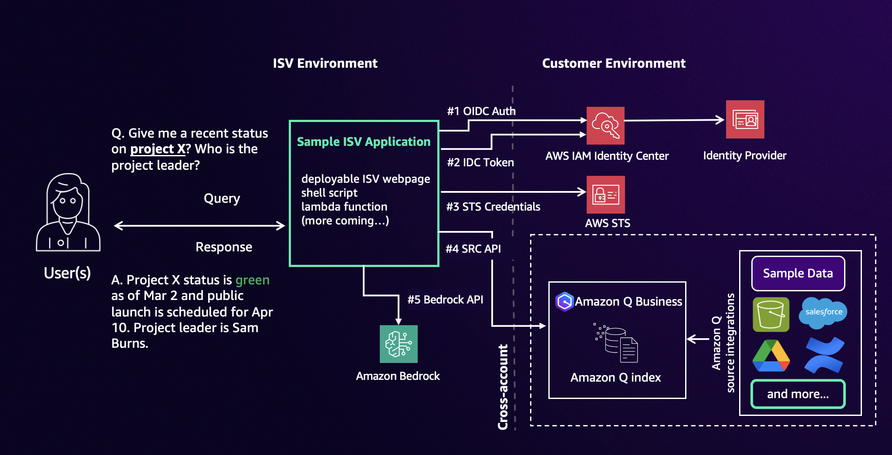
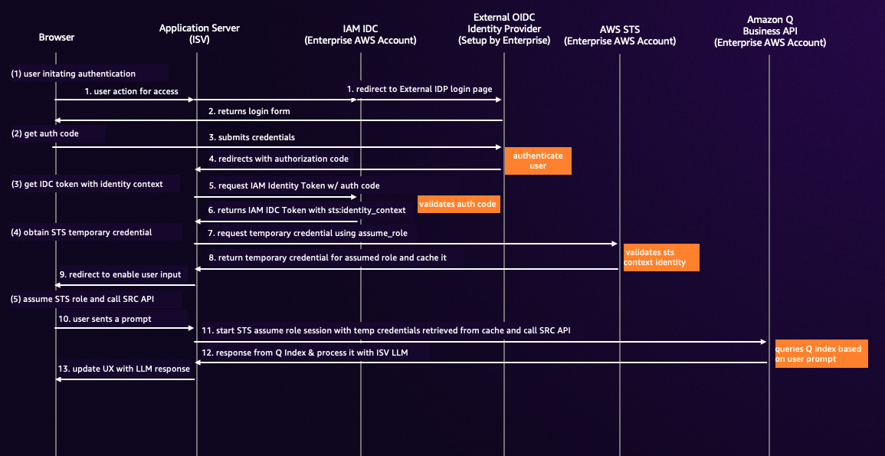
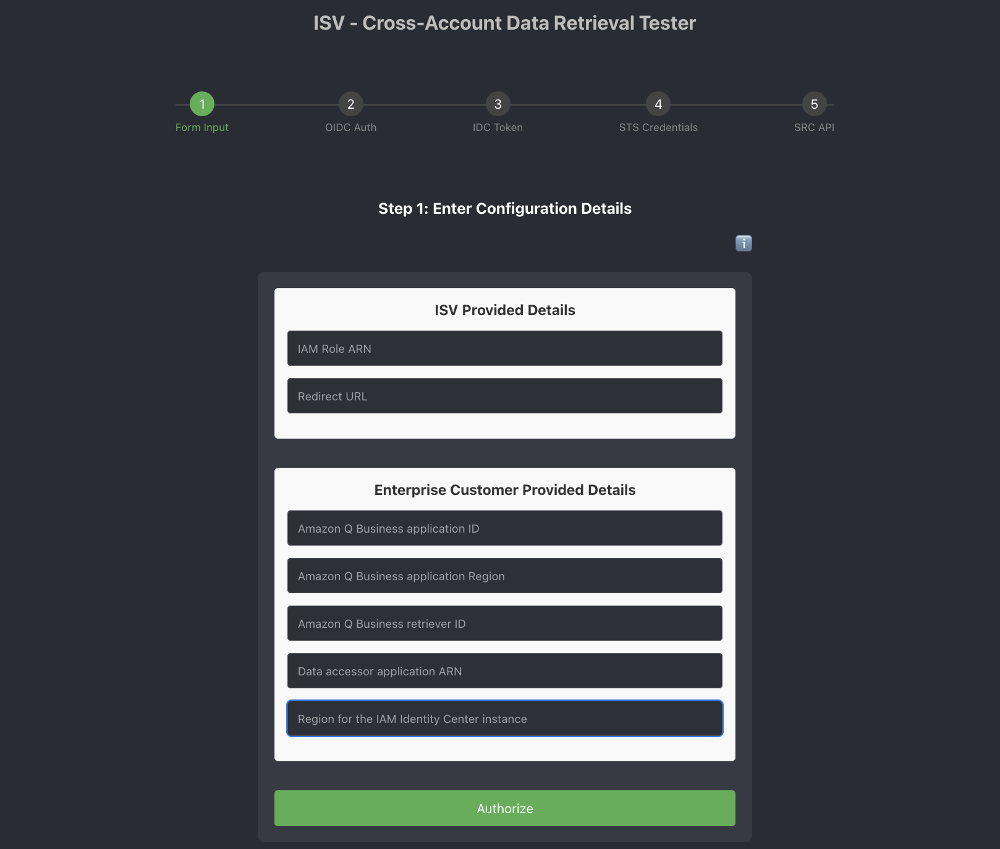
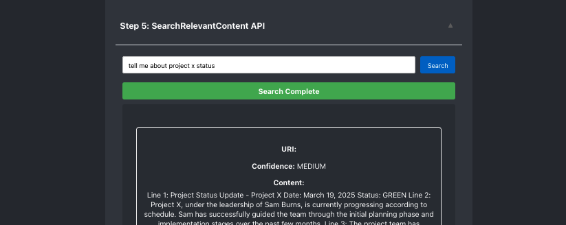

# Cross-Account Data Retrieval Tester for Amazon Q index

## Overview

[Amazon Q index for ISVs](https://aws.amazon.com/q/software-provider/) is a capability that enables ISVs to access customers' enterprise data through Amazon Q Index to enhance their SaaS solutions with generative AI experiences. The service enables ISVs to utilize customers' Retrieval Augmented Generation (RAG) data in a novel approach compared to traditional connector-based data source integration. The service includes key features such as multi-tenancy isolation within the Amazon Q Index and direct API access through [Search Relevant Content API](https://docs.aws.amazon.com/amazonq/latest/qbusiness-ug/isv-calling-api-idc.html) for headless Amazon Q Business implementation. These capabilities support authenticated user experiences and enable ISVs to enrich their own generative AI applications and enhance end-user experiences.

How does an ISV’s access to customers’ Amazon Q index data work? The process involves three simple steps: 

1.	The ISV registers with AWS a data accessor.
2.	The customer adds that ISV as a data accessor to enable access to their index.
3.	The ISV can then query the customer’s index through cross-account Search Relevant Content API requests. 


This solution demonstrates cross-account data retrieval functionality for Amazon Q Index using AWS IAM Identity Center (IDC) authentication setup on Amazon Q Business. The application implements a step-by-step process for user authentication, token generation, obatain temporary credential and data retrieval through Search Content Retrieval API.



## Features

- CDK deploys Cross-Account Data Retrieval Tester application in ISV environment which helps demonstrate the user authentication, token generation and credential retrieval to make Search Content Retrieval API call.
- [optional] CDK helps deploy Amazon Q Business with assigned IAM IDC instance you prepared and ingests a sample data to test with. This step is not required with you have Amazon Q Business application already running with IAM IDC as access management.

## Prerequisites

- Node (v18) and NPM (v8.19) installed and configured on your computer
- AWS CLI (v2) installed and configured on your computer
- AWS CDK (v2) installed and configured on your computer (if running CDK to deploy Amazon Q Business)

- Two AWS Accounts (one account as ISV, another account acting as enterprise customer)
- Data accessor registered for your ISV and make sure to add https://localhost:8081 as one of the redirect URLs ([see details on the process](https://docs.aws.amazon.com/amazonq/latest/qbusiness-ug/isv-info-to-provide.html))
- IAM Identity Center (IDC) instance setup with user added on enterprise customer AWS account
- Amazon Q Business application setup with IAM IDC as access management on enterprise customer AWS account [optional - CDK deployment for easy setup]
- Docker installed (for deploying CDK only; used for packaging python libraries to Lambda function)

## Key Components

The key component of this solution is to show the user authentication flow step-by-step (OIDC authentication with AWS IAM Identity Center, Token generation and management, STS credential handling) required to make Amazon Q Business's [SearchRelevantContent API](https://docs.aws.amazon.com/amazonq/latest/api-reference/API_SearchRelevantContent.html) requests to cross-account Q index on customer's environment.



This flow illustrates user authentication process in order for ISV application to make SearchRelevantContent API to access customer's Q index that this frontend solution demonstrates in steps.

## Deployment Steps

### Amazon Q Business deployment (CDK) on customer environment

This is an optional step if you need Amazon Q Business deployment with dummy data inserted into the Q index automatically. Instead you can manually set this Q index in your customer environment AWS account. 

This step assumes you already have IAM Identity Center (IDC) instance setup on your customer environment AWS account. For instructions how to setup IAM IDC, (see here)[https://docs.aws.amazon.com/singlesignon/latest/userguide/enable-identity-center.html].

1. In your terminal navigate to `cross-account-qindex-demo/cdk-stacks`
2. If you have started with a new environment, please bootstrap CDK: `cdk bootstrap`
3. Deploy the CDK Stack
- Run the script: 
```
cdk deploy EnterpriseStack --parameters IdentityCenterInstanceArn=<<insert your IDC instance ARN>>
```
To find your IDC instance ARN, go to AWS Management Console and navigate to IAM Identity Center > Settings


[!NOTE]
If you are seeing CDK deployment errors, re-confirm IDC instance ARN is correct and your AWS credentials that you are using to deploy CDK is from AWS account on customer environment.

4. Wait for all resources to be provisioned before continuing to the next step
5. Navigate to Amazon Q Business application that was just created and click on `Manage user access`

6. Select `Add groups and users` and search for the user or group from IAM IDC that you want to add for this

### Setup data accessor (ISV) on Amazon Q Business on customer environment

1. Navigate to your Amazon Q Business application on AWS Management console 
2. Select `Data accessors` from the left menu, and select `Add data accessor`
3. Select your data accessor from the list

4. Select `All users with application access` on User access

5. Once your data accessor is added, you will see the parameter details on the screen. Note these values as you will need these values in the next step


### Frontend deployment on ISV environment

These instructions assume you have completed all the prerequisites.

1. Clone the solution to your computer (using `git clone`)

2. Set AWS credentials of your AWS account for ISV environment
    - In your terminal, navigate to `cross-account-qindex-demo/frontend`
    - Create .env.local file by `vi .env.local` and enter environment variables in the following format
```
REACT_APP_AWS_ACCESS_KEY_ID=<<replace with your AWS_ACCESS_KEY_ID>>
REACT_APP_AWS_SECRET_ACCESS_KEY=<<replace with your AWS_SECRET_ACCESS_KEY>>
REACT_APP_AWS_SESSION_TOKEN=<<replace with your AWS_SESSION_TOKEN>>
```

3. Deploy and run the frontend in your local host
    - In your terminal, navigate to `cross-account-qindex-demo/frontend`
    - Run `npm install`
    - Run `npm start` which will run the server in `https://localhost:8081`

## Usage

1. Navigate to `https://localhost:8081`

2. Insert the details on each field and click `Authorize`
    - ISV Provided Details
        - **IAM Role ARN** - This is the IAM role created by ISV when registering for data accessor
        - **Redirect URL** - Enter `https://localhost:8081` for this demo
    - Enterprise Customer Provided Details
        - **Amazon Q Business application ID** - Go to enabled data accessor page on AWS Management Console to find this information
        - **Amazon Q Business applicagion Region** - Go to enabled data accessor page on AWS Management Console to find this information
        - **Amazon Q Business retriever ID** - Go to enabled data accessor page on AWS Management Console to find this information
        - **Data accessor application ID** - Go to enabled data accessor page on AWS Management Console to find this information
        - **Region for the IAM Identity Enter instance** - Go to enabled data accessor page on AWS Management Console to find this information


3. Confirm each steps 2 - 4 have been generated successful and enter prompt in Step 5 to get index results



4. [optional] Add more sources to your Amazon Q Business through different connectors to be able to get more variety of index results

## Clean Up

To remove the solution from your account, please follow these steps:

1. Remove CDK Stacks
    - In your terminal, navigate to appfabric-data-analytics/cdk-stacks
    - Run `cdk destroy --all`

## Using This In Production

It is critical that before you use any of this code in Production that you work with your own internal Security and Governance teams to get the appropriate Code and AppSec reviews for your organization. 

Although the code has been written with best practices in mind, your own company may require different ones, or have additional rules and restrictions.

You take full ownership and responsibility for the code running in your environment, and are free to make whatever changes you need to.